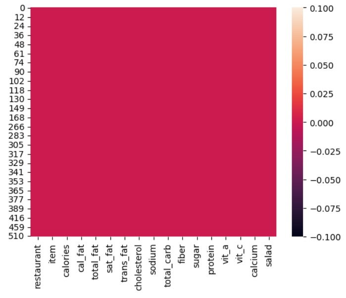

# Laporan Proyek Machine Learning
### Nama : Deni Andriansyah
### Nim : 211351040
### Kelas : Pagi B

## Domain Proyek

Estimasi makanan cepat saji yang tinggi akan kalori, jika tidak menyeimbangkannya dengan aktivitas fisik yang cukup dapat menyebabkan kelebihan berat badan dan obesitas. Kondisi ini meningkatkan risiko terkena berbagai penyakit, seperti diabetes, penyakit jantung, dan beberapa jenis kanker. Untuk itu saya berupaya membuat perhitungan kalori dengan 8 parameter yang sudah ditentukan agar mencegah kalian terkena berbagasi resiko penyakit.

## Business Understanding

Agar kalian dapat memilih makanan cepat saji yang jumlah kalorinya tinggi, sedang dan rendah untuk mencegah terkena berbagai resiko penyakit.

Bagian laporan ini mencakup:

### Problem Statements

Ketidaktahuan orang pada makanan cepat saji yang tinggi, sedang, dan rendah akan kalorinya.

### Goals

Agar kalian waspada dalam membeli makanan cepat saji dan menjaga pola hidup sehat agar terhindar dari berbagai resiko penyakit.

### Solution statements
- Pengembangan estimasi kalori berbasis web yang mengembangkan penjumlahan kalori pada makanan cepat saji untuk memudahkan pengguna dengan antarmuka yang sederhana agar mengetahui jumlah kalori berdasarkan serat pangan, total karbohidrat, sodium, kalori dari lemak, total lemak, lemak jenuh, protein, dan gula dengan menggunakan model algoritma regresi linear.

## Data Understanding
Dataset yang saya gunakan saya mengambilnya dari Kaggle yang berisi informasi tentang kalori, lemak, karbohidrat, protein, dan nutrisi penting lainnya, kumpulan data ini memberikan sumber daya berharga bagi ahli gizi, peneliti, dan individu yang sadar kesehatan. Dengan menganalisis kumpulan data ini, kita dapat memperoleh pemahaman yang lebih baik tentang dampak nutrisi dari konsumsi makanan cepat saji dan berupaya menciptakan pilihan makanan yang lebih sehat.<br>
[Fastfood Nutrition](https://www.kaggle.com/datasets/ulrikthygepedersen/fastfood-nutrition).

Selanjutnya uraikanlah seluruh variabel atau fitur pada data. Sebagai contoh:  

### Variabel-variabel pada Heart Failure Prediction Dataset adalah sebagai berikut:

- calories : Merupakan kalori pada makanan dan minuman.(int)
- fiber : Merupakan serat pangan.(float)
- total_carb : Merupakan jumlah total kabohidrat.(int)
- sodium : Merupakan penyedap dari bahan alami.int()
- cal_fat : Merupakan kalori dari lemak.(int)
- total_fat : Merupakan total lemak.(int)
- sat_fat : Merupakan lemak jenuh.(float)
- protein : Merupakan protein pada makanan.(float)
- sugar : Merupakan rasa manis pada makanan.(int)

## Data Preparation
Dataset yang saya gunakan yaitu mengambil dari Kaggle

Pertama import library yang akan digunakan
``` bash
import pandas as pd
import numpy as np
import matplotlib.pyplot as plt
import seaborn as sns
from sklearn.model_selection import train_test_split
from sklearn.linear_model import LinearRegression
from sklearn.metrics import r2_score
```
Selanjutnya agar bisa mendownload dataset dari Kaggle melalui  google colab  dengan Kaggle buat token di Kaggle lalu download
dan unggah token yang sudah di download  pada script di bawah ini
```bash
from google.colab import files
files.upload()
```
Setelah mengupload tokennya, bisa di lanjut dengan membuat sebuah folder untuk menyimpan file kaggle.json yang sudah diupload 
File kaggle.json berisi kunci API Anda yang akan digunakan untuk otentikasi saat menggunakan API Kaggle 
```bash
!mkdir -p ~/.kaggle
!cp kaggle.json ~/.kaggle/
!chmod 600 ~/.kaggle/kaggle.json
!ls ~/.kaggle
```
Selanjutnya mendwonload dataset dari Kaggle
```bash
!kaggle datasets download -d ulrikthygepedersen/fastfood-nutrition
```
Setelah terdownload extract file yang telah terdownload tadi
```bash
!mkdir fastfood-nutrition
!unzip fastfood-nutrition.zip -d fastfood-nutrition
!ls fastfood-nutrition
```
Lanjut dengan membaca file csv yang telah di extract sebelumnya
```bash
df = pd.read_csv('/content/fastfood-nutrition/fastfood.csv')
```
Lalu melihat 5 baris pertama pada datasetnya untuk memeriksa data apakah sudah benar
```bash
df.head()
```
Dan juga melihat 5 baris terakhir pada dataset untuk memeriksa data apakah sudah benar juga
```bash
df.tail()
```
Dikarenkan ada nilai yang hilang maka disini akan menghapus nilai tersebut
```bash
df.dropna(inplace=True)
```
Selesai menghapus data yang hilang, agar dapat melihat mengenai type data maka
```bash
df.info()
```
Selanjutnya disini akan memeriksa apakah sudah aman atau masih terdapat nialai yang hilang
```bash
sns.heatmap(df.isnull())
```
 <br>
Bisa dilihat aman
Selanjutnya gar mengetahui detail informasi dari dataset
```bash
df.describe()
```
Lalu selanjutnya agar mengetahui jumlah masing-masing jenis restoran yang terdaftar 
```bash
df['restaurant'].value_counts()
```
Dan juga disini agar mengetahui jumlah masing-masing jenis item 
```bash
df['item'].value_counts()
```
Selanjutnya 
## Visualisasi Data
Untuk melihat visualisasi dan memahami hubungan antara berbagai fitur dalam dataset dengan warna yang menggambarkan tingkat dan arah korelasi antar fitur
```bash
plt.figure(figsize=(10,8))
sns.heatmap(df.corr(), annot=True)
```
 <br>


**Rubrik/Kriteria Tambahan (Opsional)**: 
- Menjelaskan proses data preparation yang dilakukan
- Menjelaskan alasan mengapa diperlukan tahapan data preparation tersebut.

## Modeling
Tahapan ini membahas mengenai model machine learning yang digunakan untuk menyelesaikan permasalahan. Anda perlu menjelaskan tahapan dan parameter yang digunakan pada proses pemodelan.

**Rubrik/Kriteria Tambahan (Opsional)**: 
- Menjelaskan kelebihan dan kekurangan dari setiap algoritma yang digunakan.
- Jika menggunakan satu algoritma pada solution statement, lakukan proses improvement terhadap model dengan hyperparameter tuning. **Jelaskan proses improvement yang dilakukan**.
- Jika menggunakan dua atau lebih algoritma pada solution statement, maka pilih model terbaik sebagai solusi. **Jelaskan mengapa memilih model tersebut sebagai model terbaik**.

## Evaluation
Pada bagian ini anda perlu menyebutkan metrik evaluasi yang digunakan. Lalu anda perlu menjelaskan hasil proyek berdasarkan metrik evaluasi yang digunakan.

Sebagai contoh, Anda memiih kasus klasifikasi dan menggunakan metrik **akurasi, precision, recall, dan F1 score**. Jelaskan mengenai beberapa hal berikut:
- Penjelasan mengenai metrik yang digunakan
- Menjelaskan hasil proyek berdasarkan metrik evaluasi

Ingatlah, metrik evaluasi yang digunakan harus sesuai dengan konteks data, problem statement, dan solusi yang diinginkan.

**Rubrik/Kriteria Tambahan (Opsional)**: 
- Menjelaskan formula metrik dan bagaimana metrik tersebut bekerja.

## Deployment
pada bagian ini anda memberikan link project yang diupload melalui streamlit share. boleh ditambahkan screen shoot halaman webnya.

**---Ini adalah bagian akhir laporan---**

_Catatan:_
- _Anda dapat menambahkan gambar, kode, atau tabel ke dalam laporan jika diperlukan. Temukan caranya pada contoh dokumen markdown di situs editor [Dillinger](https://dillinger.io/), [Github Guides: Mastering markdown](https://guides.github.com/features/mastering-markdown/), atau sumber lain di internet. Semangat!_
- Jika terdapat penjelasan yang harus menyertakan code snippet, tuliskan dengan sewajarnya. Tidak perlu menuliskan keseluruhan kode project, cukup bagian yang ingin dijelaskan saja.

